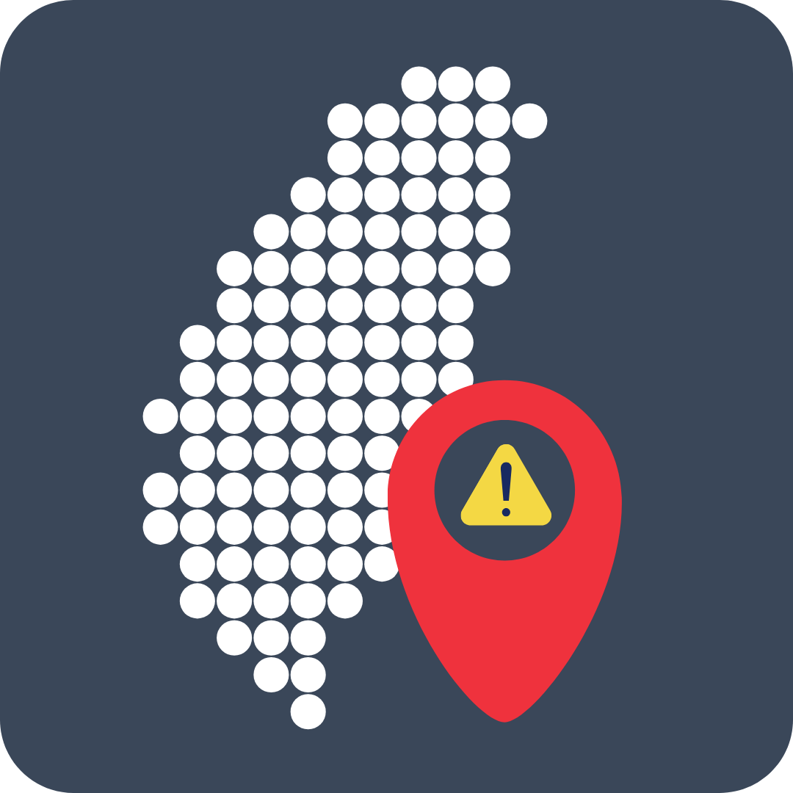

# TESIIS 臺灣避難收容處所地圖

<br>

目前部署於 [tcf.itousouta.me](https://tcf.itousouta.me)

用地圖快速查詢全臺避難收容處所，查看最近設施、搜尋條件、座標可信度，並可直接交給手機上的地圖 App 導航。

本專案源自 2025 臺北程式設計節城市通微服務大黑客松團隊 30 的作品。經持續維護後現為可獨立部署的 Flutter Web，不依賴臺北通 SDK、登入狀態或 Google Maps API Key。

> 本系統是查詢輔助工具，並非官方災害應變系統。災害發生時，請以各地政府的即時公告與指示為準。

## 功能

- 搜尋全臺避難收容處所，支援名稱、地址與分類篩選。
- 依目前地圖視野分群載入標記，不必一次下載整份資料。
- 取得使用者位置後顯示最近設施；搜尋半徑會隨地圖縮放調整。
- 優先使用最近一次的位置，並在背景更新定位結果，降低首次開啟等待時間。
- 顯示設施座標品質與資料來源，避免把概略位置誤認為精確入口。
- 使用內政部國土測繪中心 WMTS 底圖，可切換電子、地形與正射影像底圖。
- 可從設施詳情一鍵開啟外部地圖導航。

## 快速開始

### 以 Docker 執行

需要 Docker Compose。

```bash
git clone https://github.com/Twcat0503/2025Taipei-codefest-team30.git
cd 2025Taipei-codefest-team30
docker compose up --build
```

開啟 <http://localhost:8080>。服務健康狀態可由 <http://localhost:8080/healthz> 查詢。

若 8080 已被使用：

```bash
WEB_PORT=8088 docker compose up --build
```

停止服務：

```bash
docker compose down
```

### 本機開發

需要 Dart SDK 與 Flutter SDK。後端與前端各開一個終端機：

```bash
cd server
dart pub get
dart run bin/server.dart
```

```bash
cd flutter_codefest
flutter pub get
flutter run -d chrome --dart-define=API_BASE_URL=http://localhost:8080/api
```

不需要設定 API Key。Flutter Web 建置正式版時，指定後端位置：

```bash
flutter build web --dart-define=API_BASE_URL=https://api.example.tw/api
```

## 架構

```text
Browser
  |
  v
Flutter Web + Nginx
  |                     \
  | /api/*               \ NLSC WMTS map tiles
  v
Dart Shelf API
  |
  +-- 消防署避難收容處所點位檔（執行期快取）
  |
  +-- 進版控的全國快照（上游失敗時的備援）
```

| 目錄 | 用途 |
| --- | --- |
| `flutter_codefest/` | Flutter 地圖介面、定位、搜尋與設施詳情 |
| `server/` | Dart Shelf API、資料正規化、快取與座標驗證 |
| `server/data/` | 全國避難收容處所快照與產生資料 |
| `e2e/` | Playwright 端對端測試 |
| `.github/workflows/` | CI、資料來源檢查與部署工作流程 |

## 資料與座標品質

主要資料來自內政部消防署「避難收容處所點位檔」，涵蓋全臺 22 縣市、約 5,900 筆設施。後端會以各縣市的地理範圍檢查座標，拒絕明顯落在錯誤縣市、海上或預設位置的資料。

上游服務可用時，API 使用近期下載並快取的資料；若上游失敗或回傳筆數異常，會退回 `server/data/shelters_nationwide.csv` 的已驗證快照。因此即使外部資料來源暫時不可用，地圖仍可正常提供查詢。

每筆設施都會回傳座標來源與精度。介面會在概略座標或缺少座標時明確提示；請不要把地圖上的標記視為災時唯一的現場指引。

若要更新全國快照：

```bash
cd server
dart run tool/build_nationwide_snapshot.dart --report
```

要忽略本機快取並重新下載上游資料：

```bash
dart run tool/build_nationwide_snapshot.dart --refresh --report
```

## API

所有 API 都掛在 `/api` 下。Docker 本機環境的完整網址為 `http://localhost:8080/api`。

| Endpoint | 說明 |
| --- | --- |
| `GET /healthz` | 服務、資料來源與快照健康狀態 |
| `GET /api/shelters` | 搜尋與篩選設施 |
| `GET /api/shelters/nearby` | 依座標與半徑找最近設施 |
| `GET /api/shelters/clusters` | 依地圖範圍與縮放層級取得分群標記 |
| `GET /api/shelters/stats` | 資料筆數與座標品質統計 |
| `GET /api/regions` | 縣市或鄉鎮的資料品質摘要 |

常用請求範例：

```bash
curl 'http://localhost:8080/api/shelters/nearby?lat=25.0478&lng=121.5170&radius=800&limit=3'
curl 'http://localhost:8080/api/shelters/clusters?bbox=121.45,25.00,121.60,25.10&zoom=13'
curl 'http://localhost:8080/api/regions?city=臺北市'
```

## 設定

後端設定可以寫在 `server/.env`，範本見 [server/.env.example](server/.env.example)。設定優先序為：命令列 port、環境變數、`.env`、內建預設值。

| 變數 | 預設值 | 用途 |
| --- | --- | --- |
| `PORT` | `8080` | API 連接埠 |
| `SNAPSHOT_CSV` | `data/shelters_nationwide.csv` | 全國資料快照路徑 |
| `CACHE_TTL_SECONDS` | `600` | 上游資料快取秒數 |
| `LOG_LEVEL` | `info` | `debug`、`info`、`warn` 或 `error` |
| `NFA_POINT_FILE_URL` | 消防署官方網址 | 覆寫點位檔來源 |

`.env` 不應提交到版本控制。若啟用選用的交通資料功能，`TDX_CLIENT_ID` 與 `TDX_CLIENT_SECRET` 只能留在伺服器環境中。

## 測試與 CI

```bash
# 後端
cd server
dart analyze
dart test

# 前端
cd flutter_codefest
flutter analyze
flutter test
```

GitHub Actions 會執行後端與 Flutter 的靜態分析、格式檢查、測試、Web 建置、Docker Compose 建置、Playwright 端對端測試，以及 Git 歷史的機密掃描。完整設定見 [ci.yml](.github/workflows/ci.yml)。

端對端測試需要完整服務：

```bash
docker compose up -d --build
cd e2e
npm ci
npx playwright install --with-deps chromium
npx playwright test
docker compose down
```

## 資料來源與授權

- [避難收容處所點位檔](https://data.gov.tw/dataset/73242) - 內政部消防署
- [臺北市可供避難收容處所一覽表](https://data.taipei/dataset/detail?id=aaf97773-3631-40e2-b3cc-da87bf2ce1d5) - 臺北市政府社會局
- [北市警政 APP 防空避難設備位置](https://data.taipei/dataset/detail?id=83eecdf1-3bbb-40f9-9484-b55b700c37ef) - 臺北市政府警察局
- [國土測繪圖資服務雲 WMTS](https://maps.nlsc.gov.tw/) - 內政部國土測繪中心

程式碼採 [MIT License](LICENSE)。資料檔與外部服務另有使用條款，重製或再散布前請閱讀 [NOTICE.md](NOTICE.md)。地圖畫面中的國土測繪中心來源標示是其使用規範的一部分，請勿移除。

## 團隊

2025 臺北程式設計節城市通微服務大黑客松 - 團隊 30「喵主餓餓女裝」

- twcat0503（[@twcat0503](https://github.com/Twcat0503)）
- 南宮柳信（[@nangong5421](https://github.com/nangong5421)）
- 伊藤蒼太（[@itousouta15](https://github.com/itousouta15)）
- Z（[@yuzen9622](https://github.com/yuzen9622)）
- q_nnn412（[@NiaN0412](https://github.com/NiaN0412)）

目前由伊藤蒼太與twcat0503持續維護。貢獻、開發環境與安全性通報方式請分別參閱 [CONTRIBUTING.md](CONTRIBUTING.md) 與 [SECURITY.md](SECURITY.md)。
